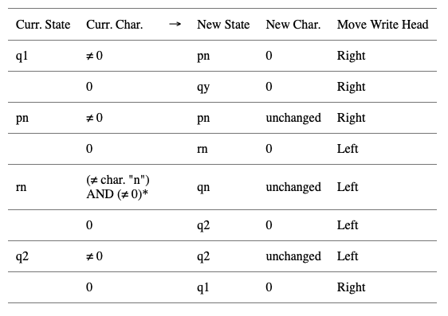
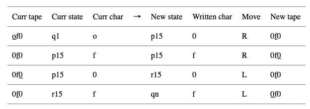
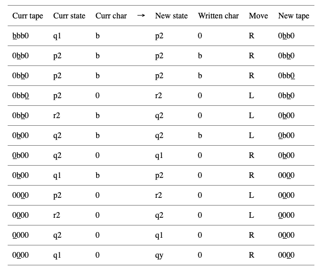

# Turing machines in Python

How to make your computer emulate a computer.

[You can read this on Medium here.](https://medium.com/p/8314fd6077d7/edit)


Image by Hans Johnson - source and license.

While you may not have access to a physical Turing machine, that should'nt stop you from simulating a Turing machine with… your computer! I will cover how Turing machines function, and Python code to build a simple one to test for alleged palindromes. I know that programs that check for palindromes are common exercise for programming beginners, and that you could simply check online or even copy some code in your favorite language. However, let's pretend that deep down you would really like to use a Turing machine for the task.

This article is inspired by Chapter 5 of Perspectives in Computation by Robert Geroch - [Amazon](https://medium.com/r/?url=http%3A%2F%2Fwww.amazon.com%2FPerspectives-Computation-Chicago-Lectures-Physics%2Fdp%2F0226288552%2Fref%3Dsr_1_11%3Fie%3DUTF8%26qid%3D1388452996%26sr%3D8-11%26keywords%3Drobert%2Bgeroch).

## What is a Turing machine?

A Turing machines consists of three parts: 
1. A tape.
2. A write head 
3. A machine state. 

The tape is divided into a sequence of squares, each of which may store a single character belonging to a given character set.

## That didn't answer much

Why are Turing machines interesting? You've definitely heard of them already, so let's just copy it quickly from Turing's own words and leave further details to Geroch's chapter referenced above.
```
It is possible to invent a single machine which can be used to compute any computable sequence.
```
A Turing machine can simulate anything, given unlimited storage space!

## How do Turing machines function?

The machine works based on a table of rules. At any given step, the write head is over some square on the tape. At this time point, the machine: (1) reads that square of the tape and (2) reads the state that the machine is in. The machine then looks in the table of rules to determine: (1) which new character to write, (2) which new state to go to, and (3) which direction, one square left or right, the head should move. Of course, the machine is allowed to print the same character and maintain the same state.

When has the machine finished? A special state is reserved for this purpose. Once the machine enters this state, the program has finished running.

Technically, we will make several simplifcations to the Turing machine. First, we will assume we have access at all times to the machine's state, and can simply measure whether or not it has finished. That is, there will be no need for the machine to write on the tape to indicate it has finished. As for the code, if you will, ignore the inefficiencies and focus on the function.

## Implementing the Turing machine

The turing machine has three elements (which we will implement as follows):
1. the state (a string named state)
2. the write head (an integer named write_head)
3. the tape (a list named tape_list)

As a simple implementation, we will write a class with these elements as follows:
```
class Turing_Machine:

    def __init__(self,state,write_head,tape_list):
        self.state = state
        self.write_head = write_head
        self.tape_list = tape_list

    def getState(self):
        return self.state

    def getHead(self):
        return self.write_head
    
    def getList(self):
        return self.tape_list
```

We'll work on the table of rules next, defined in `updateMachine`.

## Table of Rules

What about the table of rules? The table that needs to be implemented is given below - an explanation follows below it. 


*There's a good reason for this that has to do with the length of the string (even number vs odd), which hopefully will be illuminated in the examples below.

This warrants some explanation! Let's start with a definition of the states:
* q1 - the initial state. Here, we read in a character n that corresponds to the nth character in the character list (provided it is not zero). This information is "stored" in the state by going in the corresponding state pn.
* pn - state after reading the nth character initially - now go right and search for the end of the string, marked by a zero.
* rn - state after finding zero on the end of the string - now compare the last character of the string. If it's a palindrome, it should be the same as the nth character that we read at the beginning, and we go into state q2. else, go to state qn, meaning "no, its not a palindrome."
* q2 - state after sucessful comparison of last character in string - now go left and search for the beginning of the string, marked by a zero. Restart the loop by going to q1.

If you are confused, some examples may be illuminating. In the tables below, we list the tape at each step (where the position of the write head is underlined), and the state and char.

First, the word "of", which is not a palindrome:



In the last line, since "f" was not the 15th character of the alphabet (namely, "o", which we read in at the first step), the machine goes to state qn, indicating correctly that "of" is not a palindrome. 

Second, the characters "bbb", which is a palindrome: 



That was horribly long, but it worked! Notice that to switch from p2 to r2 the second time while reading a zero, our extra * condition in the rules table was used.
Or, whatever, it works.
For the code, again, keep it simple and use if and elif statements:

## Setting up input/output

We still need a way to input a string into the program, and also to set the initial state of the machine, the starting write-head position, and write the string onto the tape. Let's do all of that now:
```
import string
import sys
from turing import Turing_Machine

def check_palindrome(initial_string):
        
    # Define Character Set (allowed characters for the palindrome)
    character_list = list(string.ascii_lowercase)
    character_list.append(' ') # to allow for spaces

    # Initial string
    print('Checking: ' + initial_string)
    print('- - -')
    initial_list = list(initial_string)

    # Quick check that you only used allow characters
    for i in initial_list:
        if i not in character_list:
            print('Error! Initial character >',i,'< not in allowed character list!')
            sys.exit()

    # Append list
    initial_list.append(0)

    # Set up the turing machine
    i_write_head = 0
    i_state = 'q1' # initial state
    i_tape_list = initial_list

    # Initiate the class
    runMachine = Turing_Machine(i_state,i_write_head,i_tape_list)
    print(runMachine.getState(),runMachine.getHead(),runMachine.getList())

    # Run the machine
    ctr=0
    while runMachine.getState() != 'qy' and runMachine.getState() != 'qn' and ctr < 1000:
        runMachine.updateMachine(character_list)
        print(runMachine.getState(),runMachine.getHead(),runMachine.getList())
        ctr += 1
    print('- - -')

    # Printout result
    if (runMachine.getState() == 'qy'):
        print(initial_string,'is a palindrome! Steps:',ctr)
    else:
        print(initial_string,'is NOT a palindrome! Steps:',ctr)
```

## Running the code

Finally, let's run the code! Again, we cheated and are accessing the state at each iteration to check whether or not the program has finished (state qn or qy). However, you can easily imagine printing on the tape a special character to indicate the result if desired (we'll leave it as an "exercise"'). Create a file called `test.py` with contents:

```
import sys

from palindrome import check_palindrome

if __name__ == "__main__":

    if len(sys.argv) != 2:
        print("Usage:")
        print("python test.py word")
        print("where word is the word to be tested as a palindrome")
        sys.exit(0)

    word = sys.argv[1]
    check_palindrome(word)
```

Running this gives:

```
> python test.py hello
Checking: hello
- - -
q1 0 ['h', 'e', 'l', 'l', 'o', 0]
p7 1 [0, 'e', 'l', 'l', 'o', 0]
p7 2 [0, 'e', 'l', 'l', 'o', 0]
p7 3 [0, 'e', 'l', 'l', 'o', 0]
p7 4 [0, 'e', 'l', 'l', 'o', 0]
p7 5 [0, 'e', 'l', 'l', 'o', 0]
r7 4 [0, 'e', 'l', 'l', 'o', 0]
qn 3 [0, 'e', 'l', 'l', 'o', 0]
- - -
hello is NOT a palindrome! Steps: 7
```
and:
```
Checking: ooo
- - -
q1 0 ['o', 'o', 'o', 0]
p14 1 [0, 'o', 'o', 0]
p14 2 [0, 'o', 'o', 0]
p14 3 [0, 'o', 'o', 0]
r14 2 [0, 'o', 'o', 0]
q2 1 [0, 'o', 0, 0]
q2 0 [0, 'o', 0, 0]
q1 1 [0, 'o', 0, 0]
p14 2 [0, 0, 0, 0]
r14 1 [0, 0, 0, 0]
q2 0 [0, 0, 0, 0]
q1 1 [0, 0, 0, 0]
qy 2 [0, 0, 0, 0]
- - -
ooo is a palindrome! Steps: 12
```

## Final thoughts

That was definitely the most tedious way ever conceived to check for palindromes! But the magic is: there is no limit to what you can implement with a Turing machine - until your computer runs out of storage.